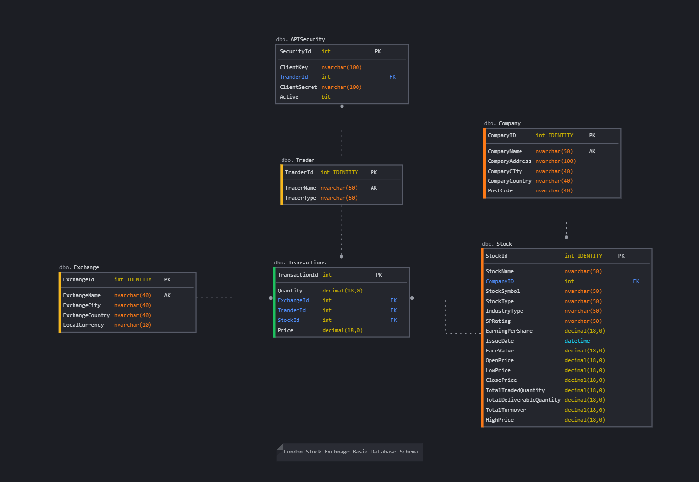
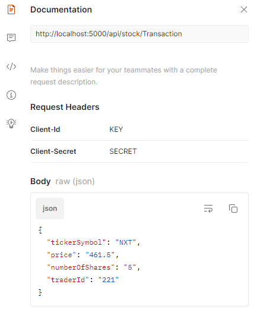
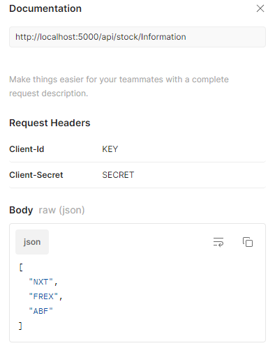

# London Stock Exchange API (POC)

## Basic Database Schema

## APIs

There are two API available in the code

1 - **[HttpPost] /api/stock/transaltion/**

2 - **[HttpGet] /api/stock/inforamtion/**

Both APIs have basic security handling implemented based on Client-Id and Client-Secret in headers. Each trader has their own unique Client-Id and Client-Secret (as seen in the database schema) to ensure only authorized traders can call the API.

Memory caching is implemented on top of the database layer to ensure frequent stocks and traders' information is stored in the memory for up to 3 hours to avoid database deadlock.  